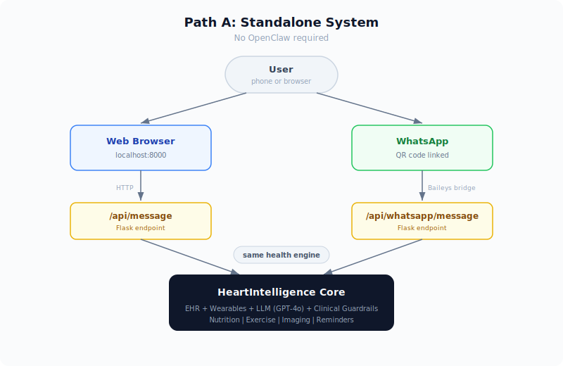
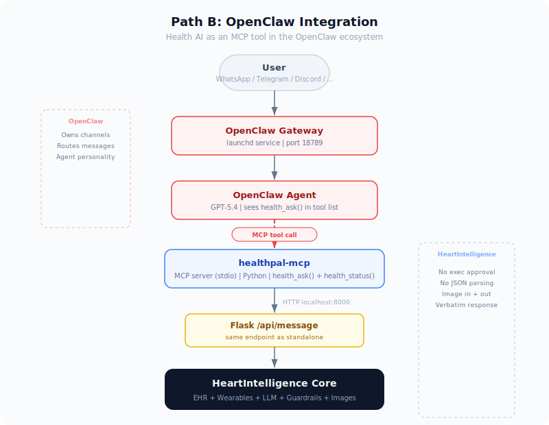

# HeartIntelligence

A personal health AI that understands your medical records, wearable data, and clinical history. Chat with it through a web dashboard, WhatsApp, or any channel via [OpenClaw](https://github.com/openclaw/openclaw).

## Getting Started

```bash
pip install -r requirements.txt
python3 app.py
```

Open **http://localhost:8000** and log in.

---

## Path A: Standalone

<p align="center"></p>

No extra setup needed. After starting the server:

- **Web dashboard** — chat, view health metrics, 3D CT visualization at `localhost:8000`
- **WhatsApp** — go to Settings in the dashboard, scan the QR code with your phone

That's it.

---

## Path B: With OpenClaw

<p align="center"></p>

If you use [OpenClaw](https://github.com/openclaw/openclaw) for WhatsApp/Telegram/Discord, you can route health questions to HeartIntelligence automatically.

**Prerequisites:** OpenClaw installed, at least one channel connected, HeartIntelligence running.

```bash
# 1. Install the integration
bash openclaw/setup.sh

# 2. Set your credentials
dreamchat configure

# 3. Restart the gateway to pick up the new MCP server
openclaw gateway stop && openclaw gateway start
```

Now send a health question on WhatsApp (or any connected channel). The agent calls HeartIntelligence directly via MCP — no approval prompts, no extra steps.

> **Behind a proxy?** The setup script handles `no_proxy` automatically. If health queries time out, see the proxy note in `devlog/2026-04-02-mcp-server.md`.

---

## CLI

All commands support `--json` for scripting.

```bash
dreamchat server status                          # server health check
dreamchat health status                          # HR, BP, steps, HRV
dreamchat health trends                          # 7-day trends
dreamchat chat ask "How's my heart rate?"        # health Q&A with full context
dreamchat chat ask --image food.jpg "calories?"  # food photo analysis
dreamchat digest daily                           # daily health summary
dreamchat reminders list                         # active reminders
```

---

## Project Structure

| Directory | Purpose |
|-----------|---------|
| `functions/` | AI agent, health analyzers, search |
| `templates/` | Web UI (chat, dashboard, CT viewer) |
| `personal_data/` | Patient records, mobile health, imaging |
| `dreamchat/` | CLI + MCP server for OpenClaw |
| `openclaw/` | Skill definition and setup script |
| `whatsapp/` | WhatsApp bridge (Baileys/Node.js) |
